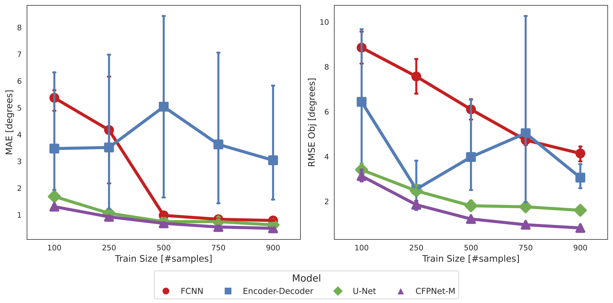
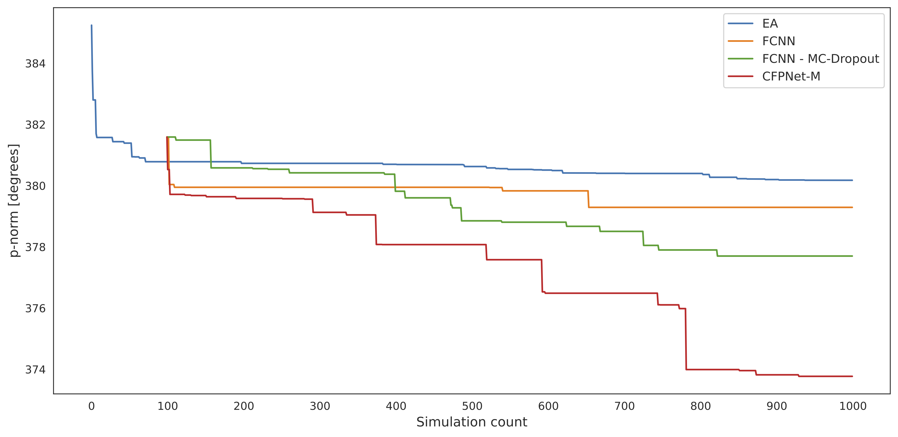

# Knowledge-Guided Surrogate-Based Optimization for Manufacturing Process Parameters

The research "Knowledge-Guided Surrogate-Based Optimization for Manufacturing Process Parameters" dives deep into the
challenges of modern-day manufacturing optimization, focusing particularly on the textile forming process.

By synergizing domain-specific knowledge with simulation modeling, this work introduces a transformative approach to
optimizing process parameters in textile forming. A significant contribution is the innovative fusion of domain insights
directly into the simulation, leading to a deeper understanding of the draping mechanism.

Two fundamental techniques to encode process parameters, "Stiffness Changes" and "Force Changes", lay the foundation for
future explorations in the domain. Moreover, a remarkable progression is the shift from simulation-based optimization to
Bayesian optimization, promising efficient parameter space exploration. Through this methodology, the research not only
bolsters textile forming efficiency but also hints at its potential adaptability across various manufacturing
challenges.

## Table of Contents

1. [Installation](#installation)
2. [Scripts Description](#scripts-description)
3. [Methodology](#methodology--key-contributions)
4. [Results](#results)
5. [Resources](#resources)

## Installation

Ensure you have Conda installed. The setup script uses Conda to create and manage the project's environment.

```bash
bash create_environment.sh
```

## Scripts Description

The repository contains various scripts essential for generating data, configurations, running experiments, and
performing hyperparameter optimization. Below is a brief description of each script:

1. **create_data.py**:
    - Purpose: Generate and save shape geometries, stiffness distributions, and strain fields.
    - Details: This script creates shape geometries based on provided node coordinates, calculates stiffness changes
      around various gripper positions, and simulates strain fields due to material properties and external forces.

2. **create_configs.py**:
    - Purpose: Generate and save configurations for model training.
    - Details: This script forms configurations by taking a cartesian product of different hyperparameters, and then
      saving them as a JSON file.

3. **experiments.py**:
    - Purpose: Facilitate the generation, training, and evaluation of neural network models.
    - Details: Provides utility functions to aid in machine learning experiments, including data loading, model
      creation, loss function assignment, and result saving.

4. **sbo_cfpnetm.py**:
    - Purpose: Perform Hyperparameter Optimization using SMAC with CFPNet-M as the surrogate model.
    - Details: Initializes a hyperparameter configuration space, establishes a particular scenario for optimization,
      defines the objective function, and employs the SMAC framework for optimization. After optimization, it validates
      and displays the results for both the default and found incumbent configurations.

5. **sbo_dense.py**:
    - Purpose: Perform Hyperparameter Optimization using SMAC with FCNN as the surrogate model.
    - Details: Similar to `sbo_cfpnetm.py`, but utilizes FCNN as the surrogate model.

6. **sbo_dense_mc.py**:
    - Purpose: Perform Hyperparameter Optimization using SMAC with FCNN incorporating MC-Dropout as the surrogate model.
    - Details: Mirrors the functionalities of `sbo_dense.py` but incorporates MC-Dropout in the surrogate model for
      optimization.

7. **sbo_ea.py**:
    - Purpose: Perform Hyperparameter Optimization using the DEAP framework.
    - Details: Commences a genetic algorithm with specific configurations, employing the DEAP framework for genetic
      operations such as mutation, crossover, and selection. Simulates and evaluates individuals' performance using an
      Oracle instance while tracking the best results. Maintains a record of the algorithm's progress, preserving each
      trial's details, and eventually saving this data in a CSV format for subsequent analysis.

## Methodology & Key Contributions

### Domain Knowledge Integration

- **Stiffness & Force Changes**: Methods to encode spring stiffnesses/forces and springs positions into images for CNNs.
- **Pixel-Wise Loss Weighting**: Improves loss calculations by emphasizing regions of importance in images.

### Adoption of CFPNet-M in Simulation

Highlighting [CFPNet-M's](https://arxiv.org/pdf/2105.04075.pdf) attributes like its compact design, rapid inference, and
performance quality, the research demonstrates its efficiency in the simulation domain as opposed to more traditional
CNN architectures.

### Bayesian Optimization (BO) Transition

Transitioning to BO using [MC-Dropout](http://proceedings.mlr.press/v48/gal16.pdf) for process optimization provides a
more balanced approach to exploring and exploiting the parameter space, which in turn speeds up the search and improves
its efficacy.

### Positional Encoding

Positional encoding has been incorporated to emphasize the spatial significance in images, aiming to enhance the
performance of neural networks.

## Results

### Model Comparison



- **Convolutional vs. FCNN**: Convolutional networks, especially U-Net and CFPNet-M, dominate FCNNs in MAE for small
  training dataset sizes and in terms of RMSE_obj across all dataset sizes.
- **CFPNet-M's Superiority**: The light-weight encoder-decoder, CFPNet-M, consistently outshines U-Net, benefiting from
  its FP Channels and CFP modules, which focus on various detail levels and object scales.
- **Encoder-Decoder Performance**: This model shows inconsistent outcomes, possibly due to its depth and lack of skip
  connections, causing potential loss of vital image details.

### SBO Results



- **Surrogate vs. Traditional Heuristics**: Surrogate models, particularly CFPNet-M, offer a more efficient exploration
  of the solution space, unlike heuristic methods that might not fully grasp the underlying function.
- **Bayesian Optimization Benefits**: Incorporating uncertainty turns optimization Bayesian, ensuring a balance between
  exploration and exploitation for potentially faster and more robust convergence.
- **Advantages of CFPNet-M in Optimization**: This precise model captures intricate dataset patterns, ensuring that the
  optimization process is driven by detailed insights leading to more optimal solutions.

## Resources

- [Master Thesis](https://drive.google.com/file/d/1xT8gdCf4KUjKuaM_V_lJjZZyNrLVJqlD/view?usp=drive_link) — The complete
  PDF document of my master thesis, providing detailed explanations and the full context of the research conducted.
- [Presentation](https://docs.google.com/presentation/d/1W_r7YDsGix6zE4SrbwfPBxiymo1WQukJ3GJEC5ftZ1Y/edit?usp=sharing) —
  The presentation of my research work, highlighting the key contributions and results.